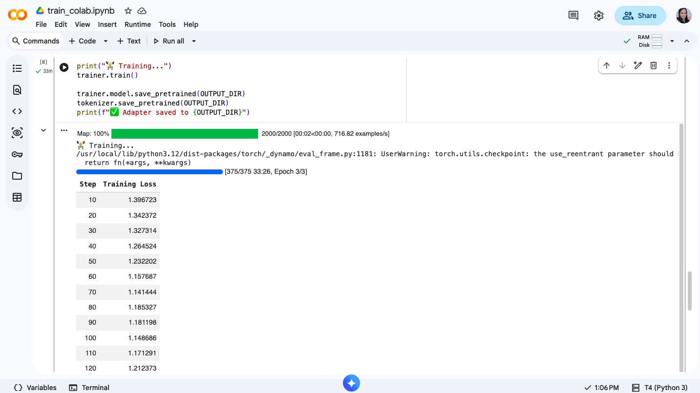
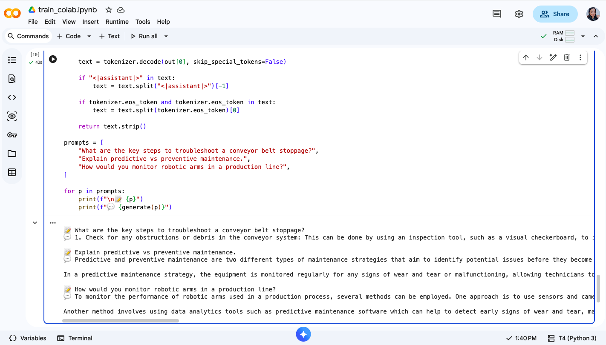

# QLoRA Fine-Tuning: Industrial Domain Adaptation

Parameter-efficient fine-tuning of TinyLlama-1.1B using **QLoRA** (4-bit quantization + Low-Rank Adaptation) for industrial/manufacturing domain.

## Why This Project

Factory AI systems need language models that understand industrial terminology, safety protocols, and manufacturing workflows. This project demonstrates parameter-efficient fine-tuning to adapt a general-purpose LLM to the industrial domain — without the cost of full fine-tuning.

## Results

| Metric | Value |
|--------|-------|
| Base model | TinyLlama-1.1B-Chat |
| Total parameters | 1,104,553,984 |
| Trainable parameters | 4,505,600 (0.41%) |
| Training loss | 1.39 → 1.05 |
| Training time | ~33 min (T4 GPU) |
| Dataset | 2,000 samples (alpaca-cleaned) |

## Training Run

Model trained on Google Colab (T4 GPU) with decreasing loss over time:



## Architecture

```
Base Model (TinyLlama-1.1B)
    │
    ▼
4-bit Quantization (NF4 + double quant)
    │
    ▼
LoRA Adapters (rank=16, alpha=32)
    target: q_proj, k_proj, v_proj, o_proj
    │
    ▼
Fine-tuned on instruction data (3 epochs)
    │
    ▼
Inference with merged adapters
```

## Key Concepts

- **QLoRA**: Quantizes base model to 4-bit while training small adapter layers in full precision
- **LoRA rank=16**: Only 0.41% of parameters are trainable — fast training, small adapter files
- **NF4**: Normal Float 4-bit quantization, optimized for normally distributed weights
- **Double quantization**: Quantizes the quantization constants for extra memory savings

## Tech Stack

- PyTorch
- HuggingFace Transformers + PEFT + bitsandbytes
- Trainer API with DataCollatorForLanguageModeling
- Google Colab T4 GPU

## Inference Example

Generated responses after fine-tuning with adjusted decoding parameters:



## Quick Start

### Google Colab (recommended)
1. Open `train_colab.ipynb` in Colab
2. Runtime → Change runtime type → T4 GPU
3. Run all cells (~33 min)

### Local (NVIDIA GPU + CUDA required)
```bash
pip install -r requirements.txt
python train.py
python inference.py
```

## Project Structure

```
├── README.md
├── requirements.txt
├── train.py              # Training script (matches Colab)
├── inference.py          # Load adapter and generate
├── train_colab.ipynb     # Colab notebook
└── .gitignore
```

## Training Config

| Parameter | Value |
|-----------|-------|
| Quantization | 4-bit NF4 + double quant |
| LoRA rank | 16 |
| LoRA alpha | 32 |
| LoRA dropout | 0.05 |
| Target modules | q_proj, k_proj, v_proj, o_proj |
| Learning rate | 2e-4 |
| Scheduler | cosine |
| Epochs | 3 |
| Batch size | 4 (grad accumulation: 4, effective: 16) |
| Max sequence length | 512 |
| Optimizer | paged_adamw_32bit |
| Precision | fp16 |

## Author

Sara Andrade — [GitHub](https://github.com/saraandrade0) | ML Engineer
